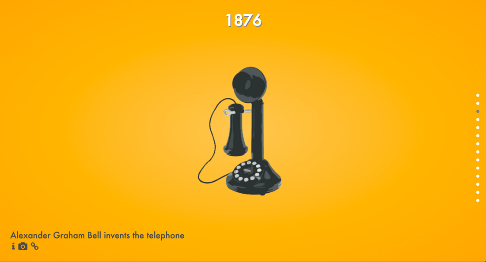
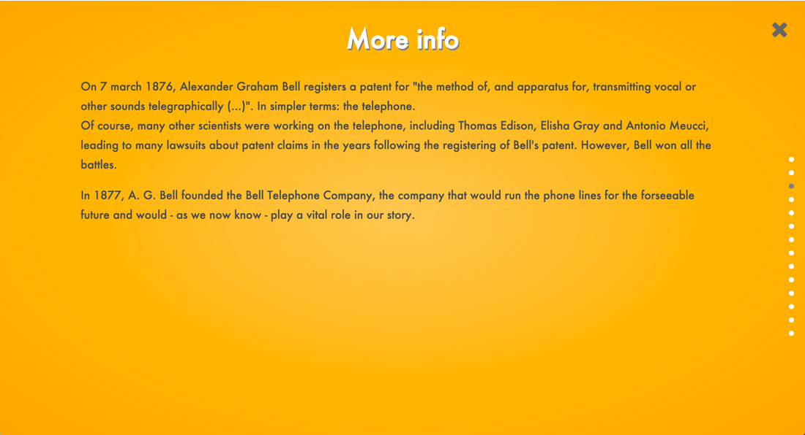
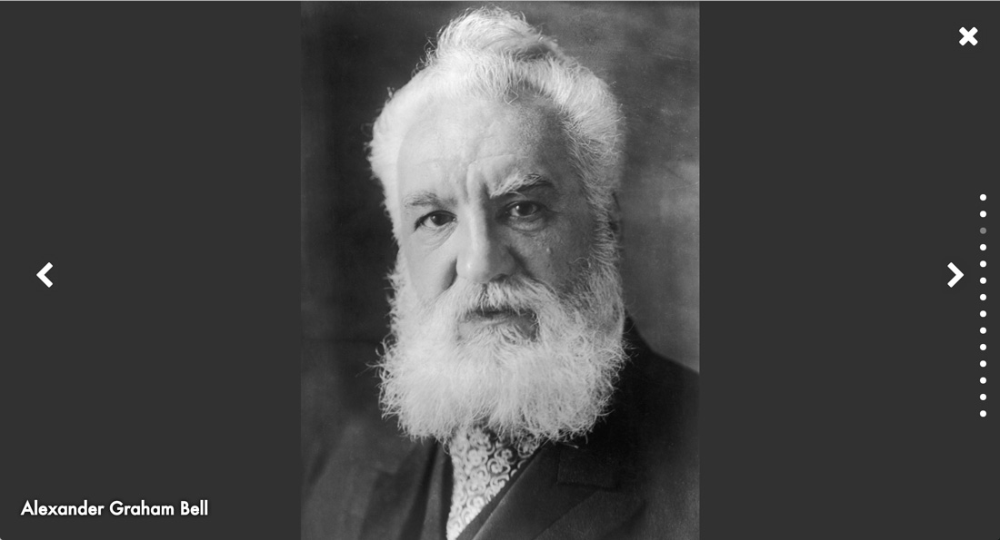
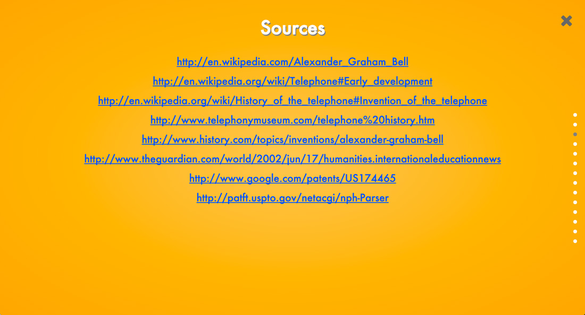

## Intro

At the end of my final year of high school, we (as in all seniors) had to make a project, combining both History and Art classes. We were free to do what we wanted, but we had to do some historical research and the final product had to be creative.

So I set out to create a fun, interactive website / presentation telling the story of communication and the Web.

## The idea
The presentation consists of 14 "slides", in chronological order, each describing a particular step in the history. On every slide, there is an almost fullscreen graphic illustrating the event, the date of the event and a short description.

The icons in the bottom left corner are links to more information: some more text, an image gallery and the sources, respectively.

### More info
A longer text, explaining the event in some more detail. I tried to keep these sections short and not too technical.

### Gallery
An image gallery containing some more illustrations I found online, each with a short description of what's in them.You can browse through the images with the arrows on both sides.

### Sources
The links to all the sources used for that slide. Nothing fancy, here.

A stack of bullets on the side and the arrow keys are used to navigate through the slides and extra info. Each part of the interface fades in/out as needed, resulting in an immersive, interesting experience.

## Technical execution
### Data
All the data is loaded as JSON when the page loads. This is done to save on filesize: the HTML markup is very repetitive, so loading the data as JSON saves a lot.

### Animations
The animations are made with CSS, coordinated by some JavaScript. The big difficulty here was timing everything correctly.
