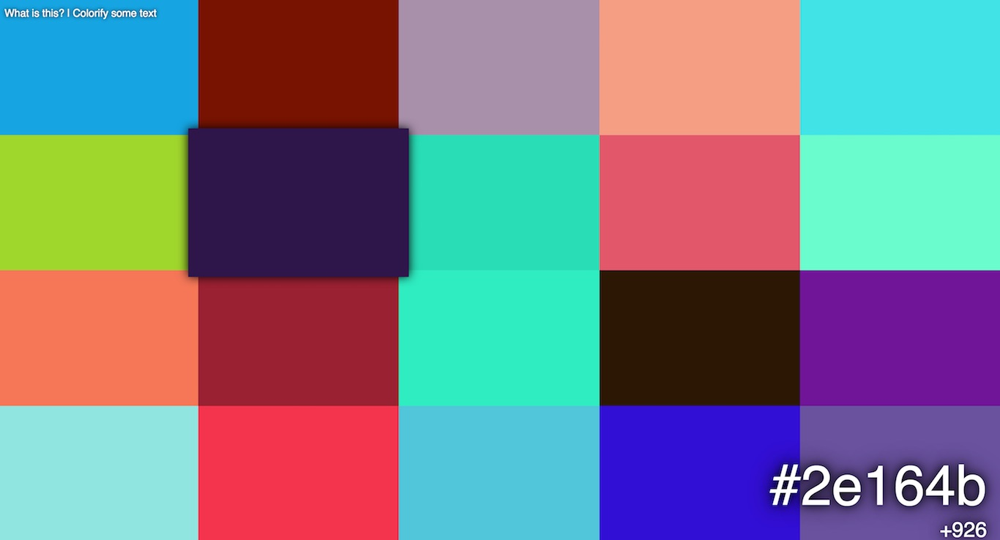
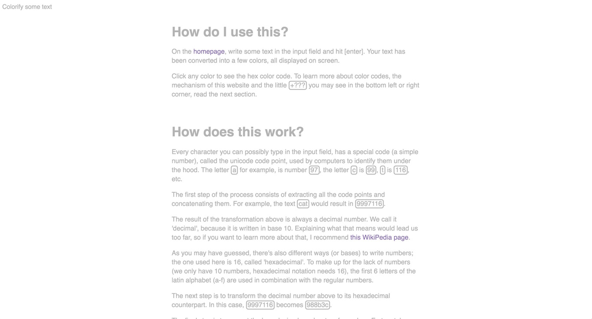

## What is colorify?
For an answer to that question, I redirect you to [the website's about page](http://colorify.tuurdutoit.be#about). Everything is explained in great detail there.

## Why?
Now, __that__ is not explained on the about page, just because it's outside its scope.  
The idea was actually a funny coincidence; I made a nice list of all the parts that converged:

* Spring break started, which means I had lots of free time on my hands to work on useless projects.
* There were a few things I wanted to experiment with, including EcmaScript6, Babel, NPM as a replacement for Grunt...
* I watched a video made by Numberphile a while ago ([watch in on YouTube](https://www.youtube.com/watch?v=wo19Y4tw0l8))

So, I got the idea to make a fun little website that would transform text into several hex colors, like the video above explains. 1 day later, colorify was finished, and this is what it looks like:

*This is the main input field; type some text, hit enter and be amazed!*

*This is the colors view; this is (obviously) the heart of it all. Click any color to see its hex code.*

*Just the about page. Nothing fancy here.*

## Technologies used
As I wrote above, this project was partly meant as a playground to mess around with some interesting technologies. Let's talk about that.

### Number conversion
The first step of the transformation, is to get the unicode code point for every character in the input string. This can easily be done with JavaScript's `.charCodeAt()` method. These numbers are then concatenated and converted to a hexadecimal string. This poses a problem, however: the biggest integer that JavaScript can (safely) store is `9007199254740992`; beyond that, freaky shit starts to happen.  
That is why I couldn't just use `parseInt()` and stringify to hexadecimal. Fortunately, I found [this article](http://www.danvk.org/wp/2012-01-20/accurate-hexadecimal-to-decimal-conversion-in-javascript/) that included a JavaScript implementation of a conversion algorithm, working with arbitrary precision and with any bases. Cool, huh?  
All I had to do, was putting the code in a file, `export` the relevant functions an `import` it in my code.

### Distribution of color planes
As you may have noticed, the color planes are not always distributed the same: depending on the amount of colors and the aspect ratio of your screen, more rows or columns are used. The code for this I wrote myself.  
Here's what is basically does: first, it divides the number of colors into primes; then, it sorts the primes (biggest first) into two groups (rows and columns), as close as possible to the given ratio. I have no idea if this is mathematically correct (it seems to work great, though), or if there is any better way of doing this (I did some research, but couldn't find anything).

### EcmaScript6 + Babel
EcmaScript6 is cool. Like there's-a-new-candy-shop-in-town cool. The modules are cool (so readable!). Arrow functions are cool (who likes to type, right?). Generator functions are cool (endless primes!). Template strings are cool (bye-bye, quote hell!).  
Fortunately, Babel is cool also, because some browsers are not.

### NPM instead of Grunt
I use Grunt in most of my projects to transform source code into optimized, ready-to-serve front-end code. A few months back, though, I read an article about how [NPM](https://www.npmjs.com/) can be used instead, thanks to the `scripts` field in `package.json`. I was interested and decided to try it out on this project.  
Turns out, NPM is great. The configuration is way easier than with Grunt (it couldn't possibly be worse, right?), you don't have to install grunt (yet another dependency), there's one less file in the repo and I use NPM already anyways. All this makes it slightly easier for me, but probably a whole lot easier for people who are new to the project: just do the simple `npm install` you have to do anyway, then run `npm run build` and you're good. No need to mess around with Grunt. And everyone knows how to write simple shell commands, don't they?
