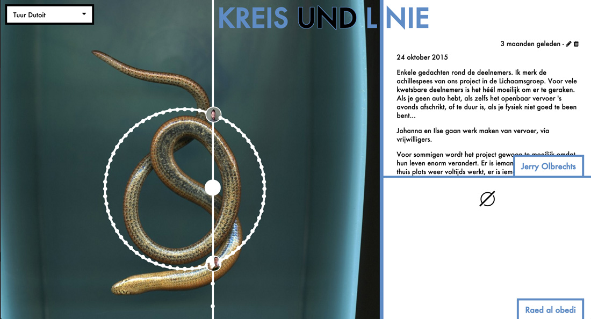
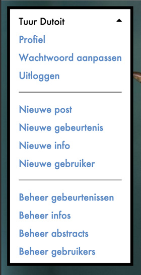
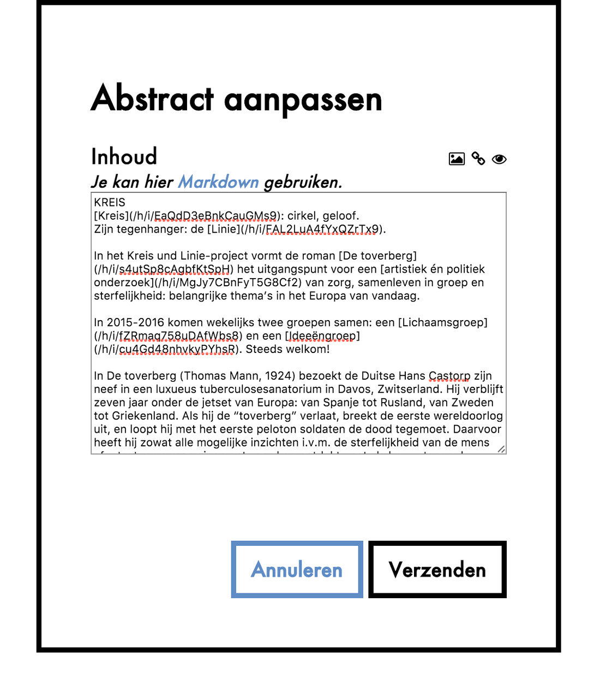
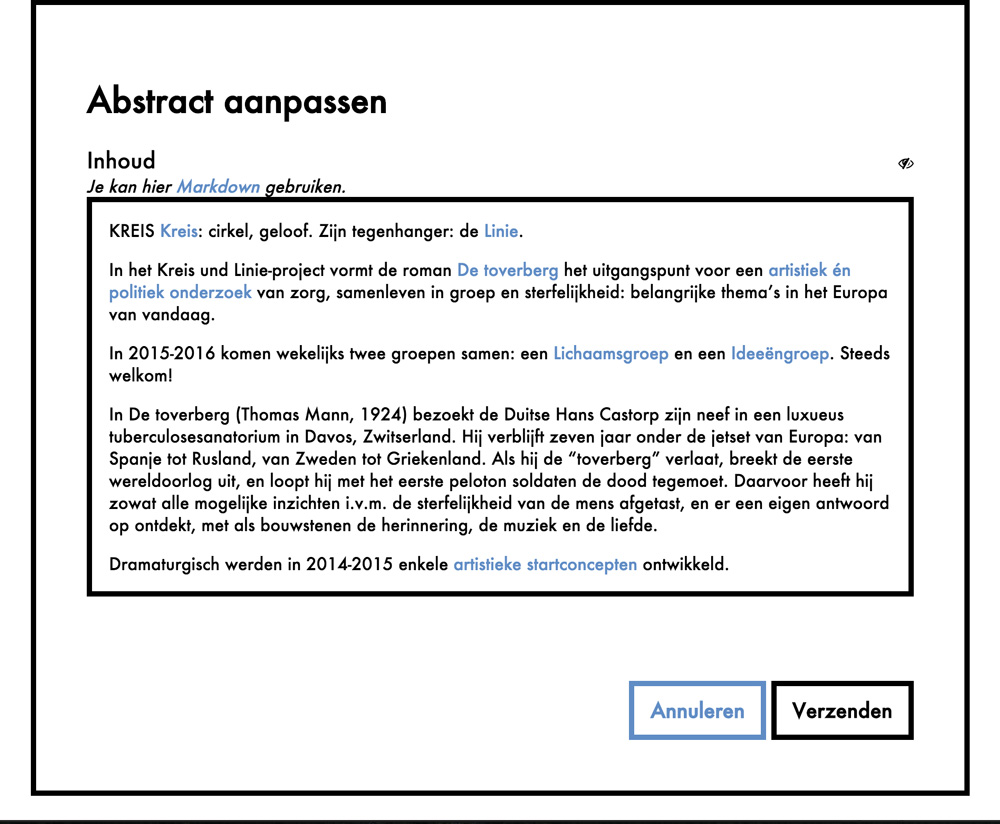
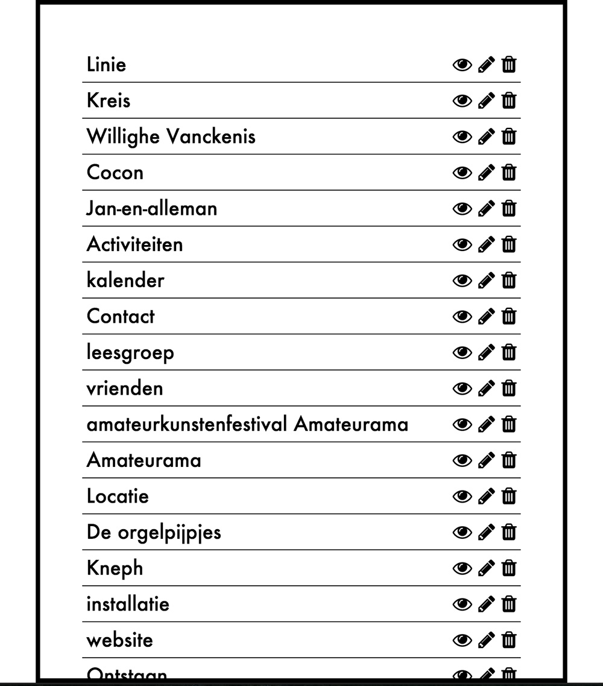
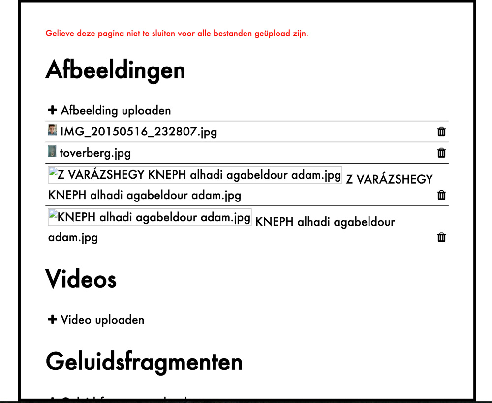

## The story
My Dutch teacher in 4th-6th grades, Jerry Olbrechts, was a big fan of theater. In fact, he's a director and actor in his free time and leads a small theater group.

Nearing the end of my final year of high school, he started a new theater project, called Kreis und Linie, based on Thomas Mann's `The Magic Mountain`, and this time, he saw it big. He wanted to create this all-inclusive, very interactive and easily accessible environment, so he set out to get about 100 actors, professionals and amateurs alike, from all possible backgrounds on the stage: full-time employees, sick people, elderly people, people with learning disorders, you name it.  
There were no auditions, the rehearsals are open: if you wanna be involved, just come over. If you miss a rehearsal, no problem.

To empower this open and organic dynamic, he asked me to make a website that would allow everyone and everything to come together. Of course, knowing him, he had a very vague, but somehow clear image of what it had to become. So I tried my best to create his dreams.

## So what's this all about?
> __Note:__ *the website is only available in Dutch. Translating everything would have been a real pain and was absolutely not necessary. Sorry for everyone who doesn't know Dutch*

### Home


The centerpiece of the site is the line and circle on the homepage. The line is in fact a timeline, tracking all the events (rehearsals, meetings,...) in chronological order. The first upcoming event is always selected when you open the homepage.  

On the circle, all the people involved in the project can be found. Every bullet represents a person; hover over it and you get to see their profile picture and name. When you click someone's bullet, you get to see their (and the person opposite them on the circle) personal 'blog', where they can post text, links, images and videos. Looking through the blogs, you can see the evolution of the project, seen through a bunch of different eyes.

When clicking on `KREIS` or `LINIE`, you get more info about the project. Knowing Jerry, there's probably 100 pages or so worth of infomation.

### Interactivity & CMS
Every user is created by an admin (me, Jerry and a few others). The person then gets an link to a page where they can set up their own profile and they can start posting to their personal blog.

#### Admins
Admins are regular users (with a profile and blog), but with some extra powers: they can not only edit and delete their own posts, but any post, made by any user. They can also create, edit and delete events on the timeline and information in the info section. And they can create, edit and delete user accounts, including making them admins or regular users.

#### The menu



The menu on the left gives access to all these functions. Regular users only get to see `profile`, `change password`, `logout` and `new post`. Admins get to see links to manage and create users, infos and events.

### Markdown



All the infos, post contents and event descriptions are written in Markdown. That's why I made a nice Markdown editor that is reused in a lot of places throughout the interface.  
The prominent element of the editor is, of course, a `textarea`. This where the Markdown source is input. But it gets more interesting as we look at the three icons just above the input.

#### Preview



The right one (the eye) is used to toggle between the source view and the preview, which previews what will be shown when the Markdown is interpreted.

#### Links



The middle icon (the chain) is only present when editing infos and is used to make links to other infos. When clicking on it, the user gets a list of existing infos. When one is selected and `select` is clicked, the link is added to the Markdown.

#### Media



It is also possible to include media in posts. When clicking the left icon (the image), the user is greeted with a filechooser, listing all the media he/she uploaded so far. Files are sorted in three categories: images, videos and sounds. If the file he/she wants to include is not yet uploaded, clicking `upload` in the right category will open the native filechooser, enabling them to upload a file.

Once their file is uploaded, they select the file they want to include and hit `select`. The right Markdown code will be added to the input field.

### Building blocks
The website is built on top of the [Meteor framework](https://meteor.com), which has been a charm sometimes, but has also been a pain some other times.

#### Reactive data
Meteor's way of handling data is pretty revolutionary, but straightforward: when the page loads, you subscribe to one or more data sets (published from the server), which are then cached on the client. When you query for data, Meteor looks for it in the client's cache, removing the roundtrip to the server, resulting in a synchronous API!. Also, Meteor keeps the data up to date in real time, so when you update some data on one client, the change is immediately sent to all other clients (that are subscribed to that data set).

#### Reactive code
One of Meteor's most impressive and at the same time most confusing (at times) feature is Trackers. Almost all the code you write in Meteor is encapsulated in a tracker, which looks what variables and queries are depended upon in that function and calls that function again when the data changes. This concept is so simple and so powerful! This way, getting data from the database and updating the UI when changes occur is basically reduced to:

```javascript
Template.myElement.helpers({
  myName: function() {
    return Users.findOne({_id: Meteor.userId}).name;
  }
});
```

Isn't that just amazing?!

#### Routing
For routing I used the most popular option, the Iron router, which is designed for Meteor and is pretty powerful. Unfortunately, keeping track of data and subscriptions wasn't very elegant. I'm sure part of the problem was me working with Meteor and Iron for the first time, but managing routes and their data wasn't very straightforward.

#### SEO
One of the major problems with Meteor (and other SPAs) is SEO. Because they rely so much on JavaScript on the client, which search engines usually don't have, or doesn't work very well, it's pretty hard to get them indexed. About the only option you have is prerendering all the pages and serving them to search engines, using the handy, but not wildly supported `_escaped_fragment_` or user agents. Luckily, some packages exist that do this automatically.

All in all, Meteor is a pretty powerful framework. Using just the basics, you can make some very impressive apps with almost no code, but once you get to some more obscure functionality, its flaws begin to show.