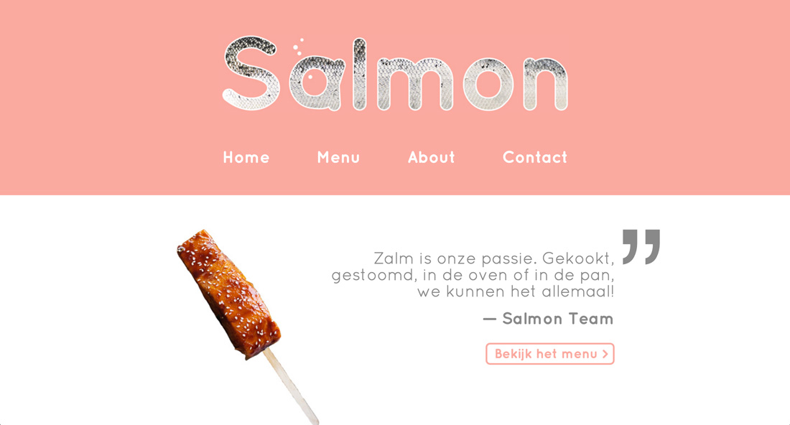

## The assignment
For my second Major assignment, I had to think of a new restaurant concept and design and develop a website for it.  
Mandatory content:

* A home page, which we could make into whatever we wanted
* A menu, listing all the dishes served in our restaurant
* An about page, explaining who we are, where the restaurant is and how it was created

## What I made

As I really love salmon, I came up with a restaurant in the mountains, right next to a lake in a beautiful environment. The restaurant consists of 10 huts, each serving salmon a different way. The idea is that people pay a set amount at the entrance and then just taste and ask for info and watch the chefs as much as they want.

The style I was aiming for was clean and stylish; the sort you would use for a very expensive and/or special restaurant.  
I used Quicksand, a clean, rounded font, throughout the whole website and used the same two bright and feel-good colors: white and salmon. A common element in the interface is the big text/numbering in the background, which gives the design some backbone.

The header, present on all pages, showcases a graphic I made in  an earlier assignment and a simple navigation.

The home page consists of two quotes, each linking to a different page, separated by a wireframe illustration of a salmon.

The footer quite simply contains some contact information: address, email, phone number, and opening hours.

The menu consists of photo's of the dishes, vertically stacked at the center of the page.The descriptions of the dishes, alternatingly on the left and right side of the dishes, are to the point, topped by a fun name and big numbering in the background. This results in a clean, ordered style, repeated throughout the website.

The about page consists of three slightly more creative blocks. The first explains the concept of the restaurant and is surrounded by images of the 10 dishes we server. A button links back to the menu to keep visitors in the loop.  
The second block tells the (fictional) story of how the restaurant was created. A family photo illustrates the text.  
The last block just contains the address, with a panorama view of the environment in the background and a pin indicating the restaurant.

The contact page wasn't required, but I gave it a shot and it came out pretty well I think. I used the common slim bottom border on the inputs and the I even made a page that confirms the data has been received correctly.