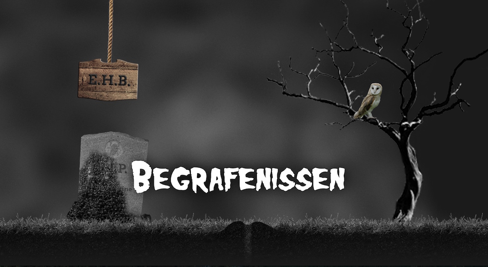

## The assignment
This time, we had to make a website that visualized 5 different but related problems, and provide each with 2 different answers. Visitors must than be able to vote for the best answers.

## What I made

I worked with a funeral theme: all the problems revolve around awkward or annoying situations at funerals.  
People can vote for their favorite answers just by clicking the appropriate block. Their vote is then sent off to the server using the brand-new fetch API, where it is processed by PHP and stored in a MySQL database (as per the assignment).

I don't have a live version running on my server, just because I don't want to clutter it by installing and running PHP and MySQL. All the code is available in GitHub, though, except the `dao/DAO.php` file, because it contains credentials for my database in the school hosting service.
