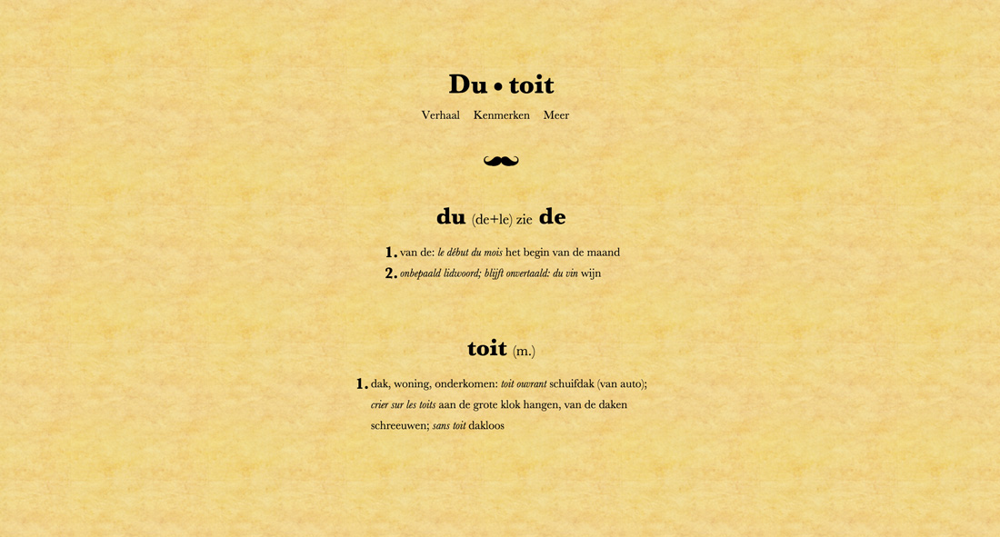

## The assignment
For my first ever Major assignment, I had to design and develop a website about my surname and my family.  
Mandatory content, all of which could be imaginary:

* A story explaining how the surname was created
* A few characteristics that are typical about our family.

So I set out to create a dictionary-inspired website.

## What I made

The top of the page was inspired by the dictionary: dry explanations, serif fonts, italics for translations. The background of the whole page is parchment pattern.

Scrolling a bit further down, users are greeted by a short story, set in France, which explains the mustaches used as separators.

Scrolling even further down, you get past 3 blocks, each explaining a different characteristic of the Dutoit family. To make the distinction clear, 3 different patterns are used as backgrounds.

Finally, the footer links to some vaguely related website (this was part of the assignment).
