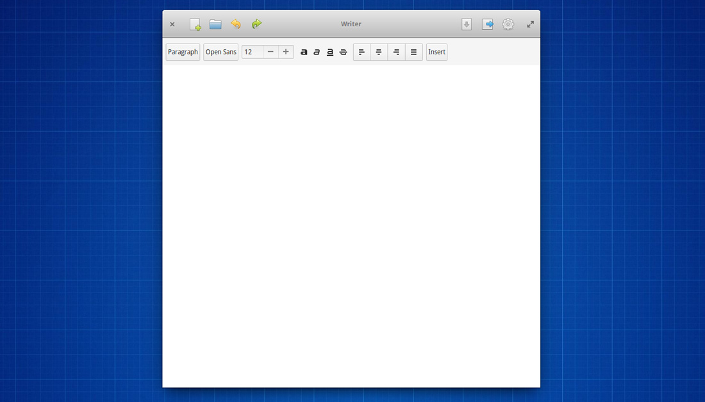

## A word on elementary OS
elementary OS is an Ubuntu-based operating system that started out a few years ago as a theme, developed by Daniel Fore. During the following years, elementary became its own distro, based on Ubuntu and GTK+, not only improving the design, but also the UX. The project is slowly getting some attention and now has 1 full-time developer.  
I have used elementary OS for a few years and really liked its philosophy.

## Why Writer?
The problem with elementary is that it is very revolutionary: they have their very own UI and UX guidelines, which don't really stroke with those of other OSs. In short: it's perfectly possible to run LibreOffice on elementary (it is based Ubuntu, after all), but it doesn't intergrate very well.

That's why I started working on a word processor, made for elementary. One that integrates well.

## The work so far

At first, everything went very smoothly: GTK has some very powerful text editing widgets and with some help from the elementary ecosystem, making a nice design proved to be pretty straightforward.

Unfortunately, I hit a major bump: showing text over different pages proved to be difficult. Working with different page sizes, printing, zooming shouldn't be too hard, but I coudn't figure out how to actually showing separate pages in the interface. I thought I probably had to mess around with some very low-level stuff, and the project stalled.

A little while ago, I bought a Macbook, and thus, I haven't used elementary and worked on Writer since.  
The basic text editing works, though. But that's about the only thing that actually works. 